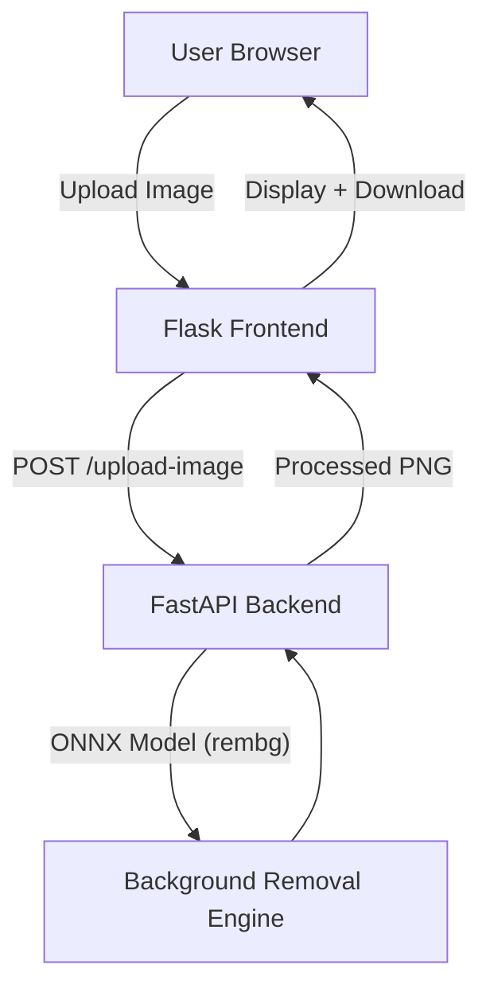

# CarClinch – Background Removal Application

This document explains how to deploy the CarClinch Background Removal App using Render and Azure.

---

## Table of Contents

- [Overview](#overview)
- [Architecture](#architecture)
- [Deployment on Render](#deployment-on-render)
  - [1. Clone the Project (Frontend-Flask Branch)](#1-clone-the-project-frontend-flask-branch)
    - [Step 1 – Create Your Own Repository](#step-1--create-your-own-repository)
    - [Step 2 – Pull the Project Branch](#step-2--pull-the-project-branch)
  - [2. Deploy Backend API on Render](#2-deploy-backend-api-on-render)
    - [Step 1 – Create Web Service](#step-1--create-web-service)
    - [Step 2 – Configure API Service](#step-2--configure-api-service)
    - [Recommended Instance Type](#recommended-instance-type)
  - [3. Deploy Frontend (Flask) on Render](#3-deploy-frontend-flask-on-render)
  - [4. Estimated Cost](#4-estimated-cost)
- [Summary](#summary)
- [Official Documentation & Technical References](#official-documentation--technical-references)

---

## Overview

CarClinch is a background removal application consisting of:

- Backend API – FastAPI + rembg (ONNX model)

- Frontend UI – Flask-based web interface

- Designed for demo deployment on Render

[Link to CarClinch Background Removal Application](https://carclinch-bg-removal-api-1.onrender.com/)

---

## Architecture



---

## Deployment on Render

### 1. Clone the Project (Frontend-Flask Branch)

The working deployment branch is:

```
frontend-flask
```
Located here:

https://github.com/DirtyPatel/carclinch-bg-removal-api/tree/frontend-flask

#### Step 1 – Create Your Own Repository

1. Create a new GitHub repository
Example name: `client-repo`

2. Clone it locally:

```
git clone https://github.com/your-username/client-repo.git
cd client-repo
```

#### Step 2 – Pull the Project Branch

Add the original repo as upstream:

```
git remote add upstream https://github.com/DirtyPatel/carclinch-bg-removal-api.git
git fetch upstream
git checkout -b frontend-flask upstream/frontend-flask
```

Push to your own repository:

```
git push origin frontend-flask
```

Now your repository contains the deployment-ready branch.

---

### 2. Deploy Backend API on Render

#### Step 1 – Create Web Service

Go to https://render.com

Click **New Web Service**

Connect your GitHub repository

Select branch: `frontend-flask`

#### Step 2 – Configure API Service

Root directory:

```
api/src
```

Build Command:

```
pip install -r requirements.txt
```

Start Command:

```
uvicorn main:app --host 0.0.0.0 --port $PORT
```

Environment Variables:
None required (unless custom configuration is needed)

#### Recommended Instance Type

Because background removal uses ONNX models and significant memory:

| Plan     | RAM   | Recommended      |
| -------- | ----- | ---------------- |
| Free     | 512MB |  Not sufficient |
| Starter  | 512MB |  May crash      |
| Standard | 2GB   |  Recommended    |

---

### 3. Deploy Frontend (Flask) on Render

Create a second Web Service.

Root directory:

```
frontend
```

Build Command:

```
pip install -r requirements.txt
```

Start Command:

```
gunicorn app:app
```

Environment Variable:

```
BG_REMOVE_API_URL=https://your-api-service.onrender.com
```

This connects frontend to backend.

---

### 4. Estimated Cost

The typical monthly cost calculation:

Workspace Professional Plan:
$19/month

API (Standard 2GB):
$25/month

Frontend (Starter):
$7/month

Total Maximum:
$51/month

If services run only part of the month, billing is prorated (charged per day).

---

## Summary

This application can be deployed:

- Quickly for demo → Render
- Production-ready → Azure

Both frontend and backend are fully portable and environment-variable driven.

---

## [Official Documentation & Technical References](/REFERENCES.md)
