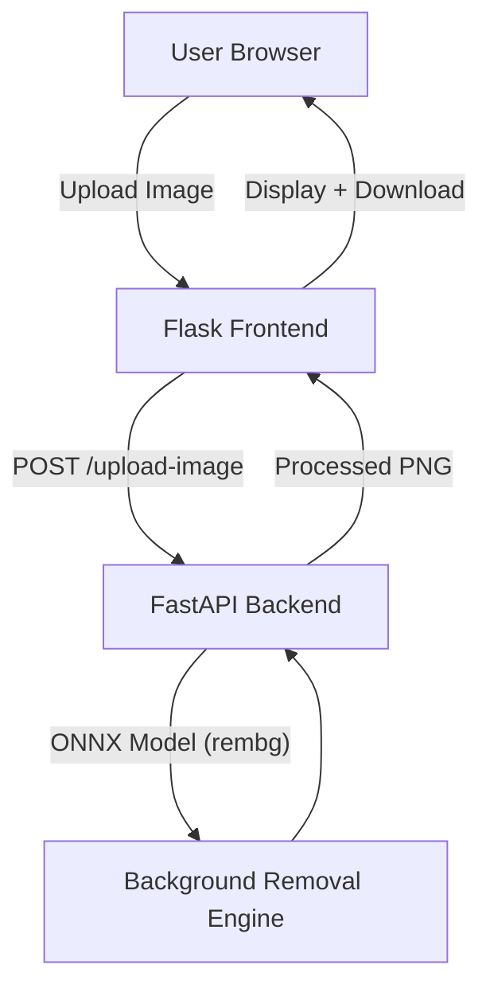

# CarClinch – Background Removal Application

## Deployment Guide (Render)

This document explains how to deploy the CarClinch Background Removal App using Render.

---

## Overview

CarClinch is a background removal application consisting of:

- Backend API – FastAPI + rembg (ONNX model)

- Frontend UI – Flask-based web interface

- Designed for demo deployment on Render

- Production-ready for Azure deployment

---

## Architecture



---

## Deployment on Render

### 1️⃣ Clone the Project (Frontend-Flask Branch)

The working deployment branch is:

```
frontend-flask
```
Located here:

https://github.com/DirtyPatel/carclinch-bg-removal-api/tree/frontend-flask

#### Step 1 – Create Your Own Repository

1. Create a new GitHub repository
Example name: `client-repo`

2. Clone it locally:

```
git clone https://github.com/your-username/client-repo.git
cd client-repo
```

#### Step 2 – Pull the Project Branch

Add the original repo as upstream:

```
git remote add upstream https://github.com/DirtyPatel/carclinch-bg-removal-api.git
git fetch upstream
git checkout -b frontend-flask upstream/frontend-flask
```

Push to your own repository:

```
git push origin frontend-flask
```

Now your repository contains the deployment-ready branch.

---

### 2️⃣ Deploy Backend API on Render

#### Step 1 – Create Web Service

Go to https://render.com

Click **New Web Service**

Connect your GitHub repository

Select branch: `frontend-flask`

#### Step 2 – Configure API Service

Root directory:

```
api/src
```

Build Command:

```
pip install -r requirements.txt
```

Start Command:

```
uvicorn main:app --host 0.0.0.0 --port $PORT
```

Environment Variables:
None required (unless custom configuration is needed)

#### Recommended Instance Type

Because background removal uses ONNX models and significant memory:

| Plan     | RAM   | Recommended      |
| -------- | ----- | ---------------- |
| Free     | 512MB | ❌ Not sufficient |
| Starter  | 512MB | ❌ May crash      |
| Standard | 2GB   | ✅ Recommended    |

---

### 3️⃣ Deploy Frontend (Flask) on Render

Create a second Web Service.

Root directory:

```
frontend
```

Build Command:

```
pip install -r requirements.txt
```

Start Command:

```
gunicorn app:app
```

Environment Variable:

```
BG_REMOVE_API_URL=https://your-api-service.onrender.com
```

This connects frontend to backend.

---

### 4️⃣ Estimated Cost

Let’s calculate typical monthly cost:

Workspace Professional Plan:
$19/month

API (Standard 2GB):
$25/month

Frontend (Starter):
$7/month

Total Maximum:
$51/month

If services run only part of the month, billing is prorated (charged per day).

---

### 5️⃣ Important Notes

The API downloads the ONNX model on first startup.

Memory usage may spike during initial load.

For production scale, Azure deployment is recommended.

Durable cloud storage (Azure Blob) can be integrated later.

---

### ✅ Alternative (Lower Cost Demo Mode)

For demonstration only:

API → Standard plan

Frontend → Free plan

Estimated cost:
~$25–30/month

---
